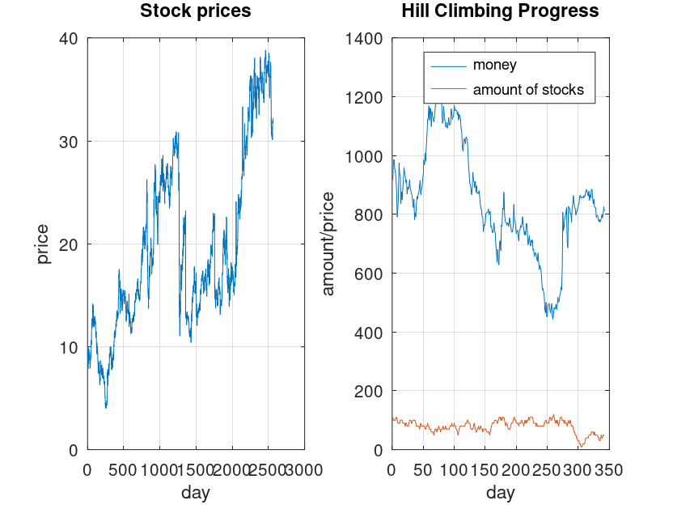

# Hill Climbing for PETR4 stocks

This project was a challenge propoused by our professor.

The idea of this project, was to implement an AI agent to buy-sell PETR4 stocks using the hill 
climbing algorithm.

To tackle this challenge, I used Octave and the data provided by [InfoMoney PETR4](https://www.infomoney.com.br/cotacoes/b3/acao/petrobras-petr4/historico/).

## The algorithm

My implementation uses the default hill climbing algorithm with some nuances. 

The agent starts with some stocks already bought and some spare money in hist wallet.

The program follows the stocks prices starting from 2015 until 2025, day by day. So at every iteration, 
the amount of money in stocks is updated by the current stock price.

Each day, the algorithm can choose between buying or selling, and the hill climbing will be in charge to 
avaliate the action outcome. The actions can be either buy or sell, being choosen at random. 
However, there're some rules it follows to avoid some edge cases:

1. it will only buy if the random function says so, and the total money in wallet is greater than 0.
2. it will only sell if the random function says so, and the amount of bought stocks are greater than 0.
3. if none of the above statements are satisfied, the agent will buy more stocks. This action leaves him with some debt to be paid later.

After that, hill climbing will check the amount of money the new action raises. If the new movement leads it to a better state,
the algorithm will update the amount of money and stocks. However, doing that, the algorithm may get stuck in some state, having no
incentive to improve his money. To solve this issue, the new state will also be updated at random with $40\%$ of chance.

## The results

After running for some time, this was the result:

